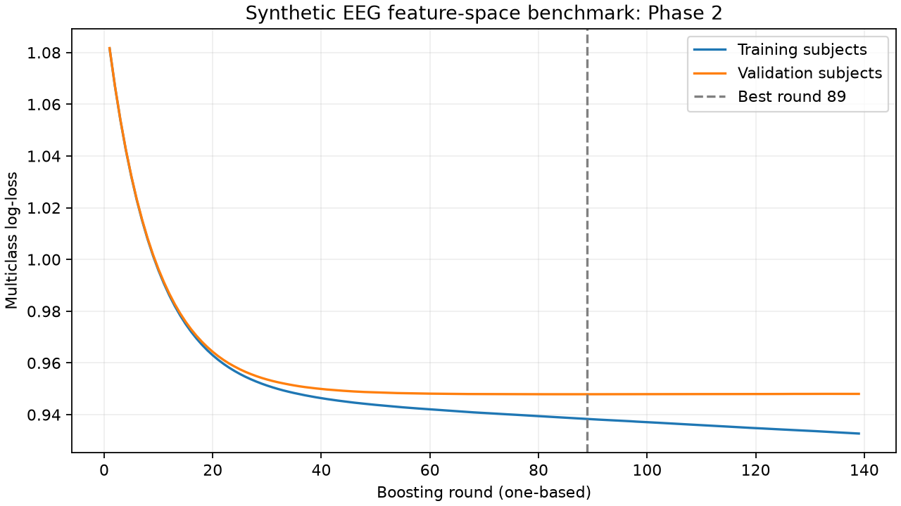

# EEG V2 Phase 2: synthetic EEG feature-space benchmark

This phase trains one uncalibrated XGBoost classifier using the verified Phase 1
manifest and frozen 20-feature EEG schema. Results describe synthetic feature
space only; they do not establish real EEG accuracy, raw-signal equivalence or
clinical validity. The Phase 1 synthetic inconsistencies remain unchanged.

## Entry point and preservation

```bash
rtk proxy .venv/bin/python -B -m src.model.train_eeg_v2_phase2 --jobs 4
rtk proxy .venv/bin/python -B -m unittest discover -s tests -p 'test_*.py' -v
```

The dedicated Phase 2 entry point adapts the existing V2 XGBoost configuration
and metric reporting while preserving the uncommitted `train_eeg_v2.py`
byte-for-byte. That legacy script still contains its original three-way split,
calibration and test evaluation; it is **not** the Phase 2 entry point.

The default model run directory is `models/eeg_v2/phase2_seed42/`. Creating it
exclusively acts as an overwrite guard before any dataset loading or fitting.
An existing directory, even an empty one, is refused. Other output paths must
be strictly below `models/eeg_v2/`. Individual model/metadata artifacts are
also created exclusively. No V1 artifact, dataset, Phase 1 artifact, existing
source file, backend, dashboard, replay component, or SQLite file is modified.
No dependency installation is needed.

## Frozen inputs and training protocol

- CSV: `data/processed/neurosense_eeg_v2_synthetic_1m.csv`, **397,983,105 bytes**.
- Dataset SHA-256:
  `6c36f1bf2c1a6a6d4ee133d9a1aac0e0ec2324bc2a79bdec65347bbf3ad4f99d`.
- Manifest: `reports/eeg_v2_phase1/split_manifest.json`.
- Manifest SHA-256:
  `2a427ef2895b9d19c4b297186ce1e8f404337fd6691e5f48c24a5c29b3cf4c29`.
- Train: **700 subjects / 700,000 rows**. Validation: **100 / 100,000**.
- Calibration: **100 / 100,000**, excluded. Test: **100 / 100,000**, excluded.
- Class encoding, fitted on training labels only:
  `0 = Distracted`, `1 = Focused`, `2 = Neutral`.
- No preprocessing is fitted. All 20 frozen numeric features are used directly;
  `subject_id`, `sample_id`, label and split metadata are excluded from columns.
- Subject IDs and sample IDs remain in the pandas index solely for provenance
  checks before fitting. The model learns from the 20 numeric columns only.

The Phase 1 loader verifies the file fingerprint and reconstructs the manifest
contract. This integrity check reads all partitions, including held-out values,
solely to verify the existing manifest. After verification, the training
interface contains only train and validation feature/label arrays. Calibration
and test arrays are never passed to an estimator, encoder, early-stopping
callback, metric function or hyperparameter search.

One fixed configuration is used; no hyperparameter search or train-plus-validation
refit is performed:

| Setting | Value |
| --- | --- |
| Maximum boosting rounds | 1,000 |
| Early-stopping patience | 50 rounds |
| Early-stopping target | Validation multiclass log-loss (`validation_1/mlogloss`) |
| Direction / minimum improvement | Minimize / 0.0 |
| Keep best model only | Yes (`save_best=True`) |
| Maximum depth | 7 |
| Learning rate | 0.08 |
| Row / column subsampling | 0.85 / 0.85 |
| Objective | `multi:softprob` |
| Tree method / device | `hist` / CPU |
| Workers | 4 |
| Subject split / XGBoost seeds | 42 / 42 |

The training and validation sets are both monitored to record complete log-loss
curves, but early stopping explicitly watches validation only. The saved native
UBJSON model discards all rounds after the best iteration. This uses XGBoost's
documented [EarlyStopping callback](https://xgboost.readthedocs.io/en/latest/python/python_api.html#xgboost.callback.EarlyStopping).
The exact installed versions, effective booster configuration and source hashes
are recorded in the run artifacts.

## Completed benchmark results

The production fit completed successfully on 700,000 training rows. Only the
100,000 validation rows were used for the following model-selection and metric
results. These are uncalibrated synthetic EEG feature-space benchmark results.

| Result | Value |
| --- | ---: |
| Model fitting duration | 34.501331000999926 seconds |
| Load, verification, fitting and artifact generation before report | 66.61080263300028 seconds |
| Boosting rounds executed | 139 |
| Best iteration, zero-based | 88 |
| Best round, one-based | 89 |
| Rounds retained in saved model | 89 |
| Non-improving rounds after best round | 50 |
| Best XGBoost validation log-loss | 0.9478859518368542 |
| Validation log-loss recomputed from probabilities | 0.9478859305381775 |
| Validation accuracy | 0.53097 |
| Validation balanced accuracy | 0.53018877788976 |
| Validation macro F1 | 0.5251210236983178 |

The small difference between the two log-loss values reflects numerical
precision and reduction differences between XGBoost's metric and scikit-learn's
metric. Both refer to the same best model and validation partition. Training
stopped through the patience rule before reaching the 1,000-round cap.

Validation confusion matrix; rows are true classes and columns are predicted
classes, both ordered Distracted / Focused / Neutral:

| True class | Predicted Distracted | Predicted Focused | Predicted Neutral |
| --- | ---: | ---: | ---: |
| Distracted | 19,343 | 5,738 | 7,977 |
| Focused | 4,828 | 21,576 | 7,441 |
| Neutral | 10,320 | 10,599 | 12,178 |

The reloaded native model produced **exactly identical** probability arrays on
all 100,000 validation rows (maximum absolute difference **0**). The UBJSON model
is **2,331,071 bytes**. Recorded runtime versions: Python 3.12.3, XGBoost 3.4.1,
scikit-learn 1.9.1, NumPy 2.5.3 and pandas 3.0.6.



## Artifacts and model loading

`models/eeg_v2/phase2_seed42/` contains:

- `xgboost.ubj`: native, uncalibrated classifier containing only the best rounds.
- `class_mapping.json`: integer-to-label mapping.
- `split_manifest.json`: byte-identical copy of the verified Phase 1 manifest.
- `booster_config.json`: effective XGBoost configuration.
- `learning_curves.json` and `learning_curves.csv`: every executed boosting
  round, including the patience rounds after the best iteration.
- `learning_curves.png`: standalone training/validation log-loss plot.
- `training_report.json`: configuration, seeds, schema, checksums, usage boundary,
  timing, best iteration, validation metrics, confusion matrix, per-class report,
  environment and artifact fingerprints.
- `reload_verification.json`: exact prediction equality after native-model reload
  on all 100,000 validation rows.

Logs and preservation evidence are in `reports/eeg_v2_phase2/`. The terminal
training output is recorded in `training.log`; the final complete test run is
recorded in `test_results.txt`; `preservation.json` records before/after hashes.

```python
from src.model.train_eeg_v2_phase2 import OUTPUT_DIR, load_phase2_model

benchmark = load_phase2_model(OUTPUT_DIR)
# features must be a DataFrame with exactly the 20 frozen columns, in order.
# Phase 2 permits validation inference only; do not evaluate held-out test data.
# probabilities = benchmark.predict_proba(features)
# labels = np.asarray(benchmark.classes)[probabilities.argmax(axis=1)]
```

The loader verifies model, class-mapping and manifest checksums, the saved
feature/class order, the best iteration, and the retained boosting-round count.
The prediction wrapper rejects missing, extra, reordered or nonfinite features.

The tests cover subject/row membership, all four split counts, feature order,
label-encoder fitting boundaries, poisoned held-out features/labels, injected
held-out indices and subjects, early-stopping configuration and actual fit
arguments, native-model save/load, tampering, learning-curve output and overwrite
protection. A published-model integration check verifies the actual run against
the Phase 1 manifest and dataset checksum.

The final combined suite passed **55 tests in 31.428 seconds**, with **0 failures,
0 errors and 0 skips**, exit code **0**. This includes the unchanged Phase 1
full-dataset manifest test and the new published-model integration test. An
earlier buffered-output attempt was interrupted with process exit code 143
before results were captured; the cause was not established. Its status is kept
in `reports/eeg_v2_phase2/test_results_interrupted.txt`. The successful rerun
streamed and saved each result as it completed.

Phase 2 ends after uncalibrated validation reporting. Probability calibration,
test evaluation and application integration require later approval. No commits
or pushes are performed.
